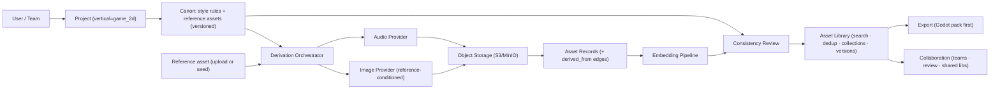
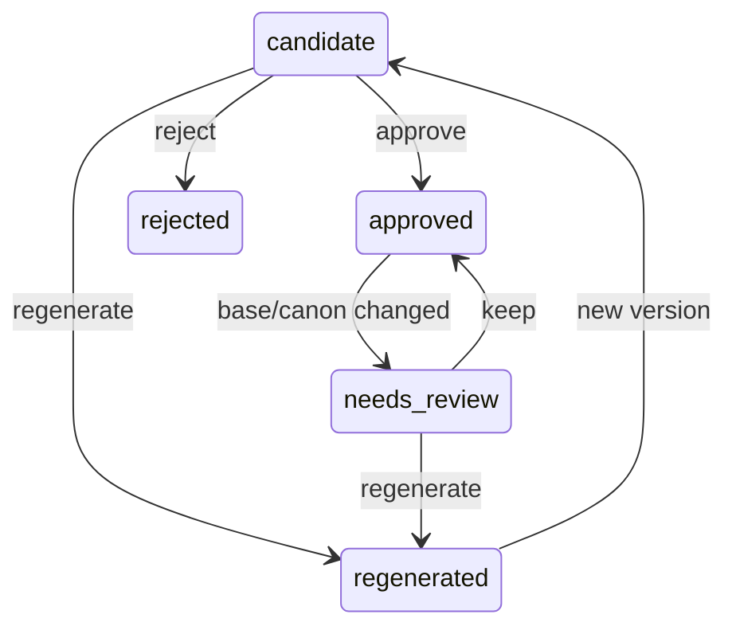

# Project Plan — Reference-Driven Visual Asset Studio (working name: **CanonForge**)

> **One line:** Bring a reference asset, generate the repetitive *consistent* derivatives from it (variants, poses, frames, matching set members), and manage the whole library — searchable, deduped, versioned, and collaborative. A domain-agnostic core for **visual** creators, with a **2D-game asset workflow** as the first deep vertical.

> **Status:** Direction committed (pivot from the earlier AI-Figma UI-generation studio — wrong brief, no moat). This is the single source of truth; it supersedes the deleted `ARCHITECTURE.md` / `ROADMAP.md`.

---

## 1. The product

Visual creators don't struggle to make the *first* asset — they struggle to make the *other 200* consistent with it. So the product is **not** a text-to-image slot machine. The core loop is **reference-driven derivation**:

```
Bring a reference (upload, or generate once + approve)
  → derive the repetitive consistent set (recolors, poses, angles, frames, matching members)
  → review consistency  → organize / search / reuse  → version + collaborate  → export
```

Generating from scratch is demoted to an *optional ideation* step to seed the first reference. The value — and the hard part — is **preserving identity and style across many derivatives**.

**Four target verticals (one shared core; game is the first deep wedge):**
- 🎮 **Game assets** *(first wedge)* — sprites, animation frames, tiles, props, UI, SFX/loops; engine export.
- 📖 **Manhwa / webtoon / comics** — one character consistent across panels, expressions, poses; backgrounds.
- 🎨 **Illustration sets** — cohesive series / sticker packs / spot-art in one style.
- 📣 **Marketing / web imagery** — on-brand icon sets, hero images, banner variants *(imagery, **not** page layout)*.

## 2. Scope boundary, positioning & moat

**Hard boundary — visual/raster assets only.** In: anything where the job is *consistent visual derivation* (the shared mechanism). **Out: page layout, UI components, and any code / structured-DSL generation** — a different mechanism *and* the moatless Figma/v0 lane this project just left. "Web design" means web *imagery*, never web *layout*.

**Moat — be honest about the two layers:**
- The **horizontal core alone has a soft moat.** Reference-consistent generation is commoditizing (gemini/"nano-banana", IP-adapter, etc.), and asset management alone is a DAM (Adobe/Eagle). A pure horizontal competes on UX + the asset-graph data gravity only.
- The **wedge is what's sticky.** One vertical built *deep* — **game, with engine export + sprite/format constraints** — is the part incumbents won't build and single-asset generators (Midjourney/Suno) can't. **Horizontal core = room to grow; vertical depth = the sale.** Always ship with at least one deep wedge; never pitch as "for every creative team."

**Four core pillars (all genuinely horizontal):** reference-driven **generation**, smart **asset management** (tag/search/dedup/reuse), **versioning** (lineage), and **collaboration** (teams/shared libraries/review). The last two already exist in the codebase.

## 3. Architecture principle — design broad, build narrow

The shared spine (reference derivation + management + versioning + collaboration) is *real*, so building the **core domain-agnostic is justified** — that's where "broad / room to grow" lives, and it's cheap. But:

- **Build the core domain-neutral** (no game hardcoding): generic schema, `role` as free text, `metadata`/`canon` as JSONB, a prompt-compiler seam, provider-agnostic generation.
- **Prove it on the game wedge first** (deep, with export).
- **Add manhwa / illustration / marketing as thin packs** later; **extract any plugin/adapter framework only from 2–3 real packs** (rule of three). A generic *core* is not the same as a premature *plugin framework* — build the former now, defer the latter.

## 4. System architecture



**Core services (domain-neutral; built concrete against game first):** `ProjectService` (+ `vertical`), `CanonService` (style rules + reference assets, versioned), `DerivationService` (compiles a reference-conditioned request from base + canon + instruction + constraints), `AssetLibraryService`, `EmbeddingService`, `ConsistencyService`, `CollaborationService` (reuses existing teams), `ExportService` (`export_godot_pack()` as a plain function first).

**Frontend:** `ProjectWorkspace` shell, `CanonView` (style + reference assets), `AssetBoardView` (search/filter/collections), `DerivePanel` (pick a base → choose derivation → review), `ConsistencyReviewPanel`, `Review/CollabPanel`, `ExportDrawer`. Game-specific bits live in a `Game2DPanel` (the only pack for now).

## 5. Data model

Keep the project / workspace / **teams** / **versioning** / storage base — these already exist and map directly. Reshape the domain around a generic asset engine with vertical fields in JSONB.

- `projects` — add **`vertical TEXT NOT NULL DEFAULT 'game_2d'`** (lets a 2nd vertical branch later without rework).
- `canon` — versioned rows (`parent_id` lineage); **JSONB** holding style rules **and references to base/approved assets**. The canon is *style + exemplars*, not just prose.
- `assets` — `name`, `description`, **`role TEXT`** (free text), `tags TEXT[]`, `status` (`candidate`/`approved`/`rejected`/`needs_review`), `width`, `height`, `duration_ms`, **`metadata JSONB`**, **`canon_version_id`**, `vertical`.
- `asset_links` — **`derived_from`** (the reference→derivative edge — the heart of this product), `variant_of`, `contains`, `used_in_export`, `replaces`, `references`.
- `asset_collections` + `_items` — packs ("Hero walk cycle", "Forest tileset", "Launch icon set").
- `generation_recipes` — reusable derivation templates ("recolor to palette", "side-walk pose", "matching enemy").
- `consistency_checks` — style-fit / duplicate / technical / export-readiness findings.
- `visual_embeddings` (exists; **no runtime pipeline yet** — net-new) + an audio store.
- `exports` + `export_items`.

**Invariants:** every derivative records its **`derived_from`** reference(s) and the **`canon_version_id`** it was made under — that powers "this predates the base/palette change — regenerate or keep?" and the lineage/collaboration views.

**Build now (reversible hedges):** `projects.vertical`, JSONB canon, `assets.role`/`metadata` JSONB, the derivation/prompt-compiler seam, an audio provider boundary mirroring [`backend/src/ai/images.rs`](backend/src/ai/images.rs). **Defer until vertical #2:** a formal adapter/plugin registry, generic-canon "vertical sections", an export-adapter interface, adapter-aware generic UI.

## 6. Consistency system (reference-first)

1. **Reference asset = primary identity anchor.** Derivations are *conditioned on the base image* (reference/img2img), not just text. This is the load-bearing mechanism.
2. **Canon = style rules + exemplars.** Structured JSON (palette, render style, perspective, proportions, negative constraints) **plus approved reference assets** and rejected examples. Constrains both derivation and from-scratch seeding.
3. **Derivation compiler.** `base reference + instruction + canon + constraints + negatives` → a reference-conditioned request. Repeatable, not chat-memory.
4. **Embedding similarity.** On insert: closeness to the base/approved references (identity check), distance from rejected examples, and dedup/reuse against the library. Audio: descriptor similarity (tempo/loudness/timbre/duration/loop).
5. **Deterministic technical checks** (credible, not vibes): alpha present, sprite size in allowed set, tile alignment, audio duration/loop seam, stable export filenames.
6. **Human approval gate.** Everything starts `candidate`; only `approved` assets enter the canon and influence future derivations (one bad gen can't poison identity).



## 7. Build sequence

> Run the **reference-derivation spike** (§8) first — it tests the core mechanism for every vertical.

- **Phase 1 — Generic core + game language.** Generic schema (§5); `canon` + `projects.vertical='game_2d'`; roles/tags/status/collections; reference upload + "seed a base from text".
- **Phase 2 — Reference-driven derivation.** Reference-conditioned generation (base → recolor / pose / variant / matching member); store `derived_from` + canon-version provenance; asset board with approve/reject/regenerate.
- **Phase 3 — Management, versioning, collaboration.** Visual embeddings on insert; "similar asset exists?"; collections + variants; surface the existing **versioning/lineage** and **team/review** layers in the UI (shared libraries, approve flow).
- **Phase 4 — Audio modality.** Audio provider boundary; SFX + loops; waveform preview; audio metadata + checks. *(Game-relevant; other verticals stay image-only.)*
- **Phase 5 — Export wedge.** Generic zip + `manifest.json`; sprite-atlas export; **Godot package first**, Unity later.
- **Phase 6 — Depth or 2nd vertical.** Deeper game workflow (tileset/character-set/UI-kit builders; base/canon-change propagation) **or** add manhwa/illustration as the second pack — and *then* extract a framework from two real verticals.
- **Animation** (sprite frame sequences) is the **highest-value, highest-risk** sub-feature — general image models are weak at frame-coherent cycles. Treat it as its **own** spike + later phase; the MVP nails reliable derivations (recolor/pose/variant/set) first.

## 8. Reference-derivation spike (do first — cheap, real spend)

**Question:** can we take a base asset and generate *consistent* derivatives that preserve its identity + style? If reference conditioning isn't strong enough, that's the whole product — find out for cents before the rewrite.

**Design (~5 images, ~$0.20):** seed or upload **one base**, then derive: (1) recolor, (2) new pose / walk, (3) attack/action pose, (4) a matching set member in the same style. (Optional stretch: a 3-frame mini cycle to gauge animation feasibility.)

**Reads (contact sheet, base alongside derivatives):**
- ✅ Derivatives clearly keep the base's identity + style → reference conditioning holds; build.
- ⚠️ Identity drifts → try stronger conditioning (multi-reference, IP-adapter-style, per-character fine-tune) and re-test before committing.

**Cost note:** bills **per image** (~$0.04 on `google/gemini-2.5-flash-image`, which is strong at reference-consistent editing) — resolution doesn't change price; **count** is the lever. Runner is **dry-run by default**; `RUN=1` to spend, `MAX_IMAGES` guard. Drop your own `base.png` in for a far more honest test. Lives in [`spikes/canon-consistency/`](spikes/canon-consistency/).

## 9. Growth roadmap (the headroom)

- **More derivations:** animation frames, angle/turnaround sheets, expression sheets, LOD/size variants.
- **More modalities:** audio (game), 3D props (Meshy/Tripo), video later.
- **More verticals (the payoff):** manhwa → illustration → marketing imagery, each a thin pack.
- **Deeper intelligence:** base/canon-change propagation, auto-variant generation, cross-project style transfer, reuse recommendations.
- **Collaboration & marketplace:** shared canons/recipes, review workflows, sellable asset/canon packs.
- **Integrations:** Godot/Unity plugin, Aseprite, Figma *asset* import; asset lineage graph; AI version-diff summaries.

## 10. What carries over from the current repo

Reuse is a bonus (clean rebuild is acceptable), but most plumbing maps directly:
- Auth, project tenancy, **teams/membership** → **collaboration** — [`backend/src/auth.rs`](backend/src/auth.rs), [`backend/src/routes/projects.rs`](backend/src/routes/projects.rs).
- Immutable artifact **versioning / lineage graph** → canon + asset versioning and `derived_from` edges — [`backend/migrations/0001_init.sql`](backend/migrations/0001_init.sql), [`backend/src/routes/artifacts.rs`](backend/src/routes/artifacts.rs).
- Object storage + authed file proxy → asset library — [`backend/src/storage.rs`](backend/src/storage.rs), [`backend/src/routes/assets.rs`](backend/src/routes/assets.rs).
- AI provider boundary + mock mode → reference-conditioned image gen, and the audio-boundary template — [`backend/src/ai/images.rs`](backend/src/ai/images.rs).
- Workspace shell, asset panel → the studio UI — [`frontend/src/app/ProjectWorkspace.tsx`](frontend/src/app/ProjectWorkspace.tsx), [`frontend/src/app/assets/AssetPanel.tsx`](frontend/src/app/assets/AssetPanel.tsx).

**Net-new:** reference-conditioned derivation (image *input*, not just text), generic canon + provenance, richer asset metadata, the embedding/dedup pipeline, deterministic checks, export packaging. **Dropped:** the UI-pipeline pieces (flow canvas, wireframe DSL, design-system/hi-fi theming) — abandoned direction.

## 11. Naming

The concept spanning every vertical is the **canon / reference memory**, so lead with it: **CanonForge** (alts: *Canon*, *Loom*). Launch on the wedge — *"Bring one sprite, get the whole consistent set, export to your engine"* — with the core ready to grow into manhwa, illustration, and marketing imagery.
